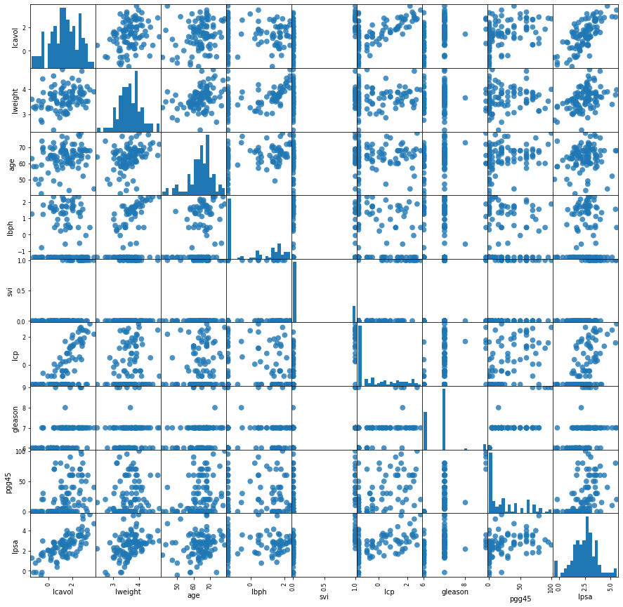

# Going Back-to-Basics
## Linear methods for regression


```python
%matplotlib inline
import numpy as np
import matplotlib.pyplot as plt
from linear_regression import linear_regression  as lr 
from sklearn import datasets
import pandas as pd
```


```python
import numpy as np
import matplotlib.pyplot as plt

class linear_regression(object):
    def __init__(
            self,
            predictors,
            X,
            Y,
            standardize=True,
            intercept=True,
            weighted=False):
        '''
            Initalize linear regression object
            with the dataset
            X = (P+1, N) dim matrix
            Y = N vector
        '''
        if standardize and intercept:
            X = (X - np.mean(X, axis=0)) / np.std(X, axis=0)
            #Y = (Y - np.mean(Y, axis=0)) / np.std(Y, axis=0)
            X = np.hstack((X, np.ones((X.shape[0], 1))))
        elif standardize and not intercept:
            X = (X - np.mean(X, axis=0)) / np.std(X, axis=0)
            Y = (Y - np.mean(Y, axis=0)) / np.std(Y, axis=0)
        elif not standardize and intercept:
            X = np.hstack((X, np.ones((X.shape[0], 1))))
        # initalized
        self.predictors = predictors
        self.X = X
        self.Y = Y

    def solve(self, solver='Simple', weighted=False):
        if solver == 'Simple':
            ret = self.solve_simple()
        elif solver == 'gs':
            ret = gs_solver()
        RSS = self._RSS()
        rsq = self.r_squared()
        zscore = self.zscore()
        print(f"***** {solver} Least-Squares Estimate")
        print(
            '{:<10.8s}{:<10.8s}{:<10.8s}{:<10.8s}'.format(
                "Predictor",
                "Coef.",
                "Std. err.",
                "Z-score"))

        dash = '-' * 40
        print(dash)
        for i in range(len(self.predictors)):
            print(
                '{:<10.8s}{:>10.3f}{:>10.3f}{:>10.3f}'.format(
                    self.predictors[i][0],
                    self.beta[i][0],
                    self.beta[i][0],
                    self.zscore[i]))
        print(f"***** R^2: {rsq}")

    def solve_simple(self, weighted=False):
        '''
            Direct least-squares solution
        '''
        self.invxtx = np.linalg.inv(self.X.T @ self.X)
        beta = self.invxtx @ self.X.T @ self.Y
        y_hat = self.X @ beta
        self.beta = beta
        self.y_hat = y_hat
        return beta, y_hat

    def gs_solver(self, weighted=False):
        '''
            Gram-Schmidt Orthogonalization:
            using QR decomposition
            R - Upper traingular matrix
            Q - 
            Note: np.linalg.qr is doing the heavy lifting
            Will write-up the householder decomp when I'm
            bored
        '''
        Q, R = np.linalg.qr(self.X)
        self.beta = np.linalg.inv(R) @ Q.T @ self.Y
        self.y_hat = Q.T @ Q @ self.U
        return self.beta, self.y_hat

    def zscore(self, weighted=False):
        '''
            Z-score
            For the jth predictor
            z_j = beta_hat_j / (sqrt(var * v_j))
            where v = (X.T*X)_jj
        '''
        v = np.diag(self.invxtx)
        var = self._var()
        self.zscore = np.ravel(self.beta)/(np.sqrt(var)*np.sqrt(v))
        return self.zscore

    def _RSS(self, weighted=False):
        '''
            Multivariate RSS Calculation
            If predictors are highly correlated,
            weight by their covariance
        '''
        self.rss = None
        err = self.Y - self.y_hat
        if weighted:
            self.rss = np.trace(err.T @ np.cov(err) @ err)
        else:
            self.rss = np.trace(err.T @ err)
        return self.rss

    def r_squared(self):
        '''
            Goodness of fit big-boy: R2
            Percent of explained variance = 
            1 - (Explained Variance) / (Model Variance)
        '''
        if self.rss:
            tss = np.sum((self.Y - np.mean(self.Y))**2)
            return 1 - self.rss/tss
        else:
            return None

    def _var(self, weighted=False):
        '''
        Returns an unbiased estimate of the sample variance sigma^2
        sigma^1 = 1/(N-p-1) * MSE
        '''
        N, p = self.X.shape
        return 1 / (N - p - 1) * np.sum((self.Y - self.y_hat)**2)
```


```python
##testing with the prostate dataset
df = pd.read_csv('.//prostate.data',sep='\s+')
#split train and test
df_train = df.loc[df['train'] == 'T']
df_test = df.loc[df['train'] == 'F']
#drop train column
df_train = df_train.drop(['train'],axis=1)
df_test = df_test.drop(['train'],axis=1)
df_train
x_train = df_train[['lcavol', 'lweight', 'age', 'lbph', 'svi', 'lcp', 'gleason', 'pgg45']].to_numpy()
y_train = df_train[['lpsa']].to_numpy()
x_test = df_test[['lcavol', 'lweight', 'age', 'lbph', 'svi', 'lcp', 'gleason', 'pgg45']].to_numpy()
predictors = ['lcavol', 'lweight', 'age', 'lbph', 'svi', 'lcp', 'gleason', 'pgg45']
y_test = df_test[['lpsa']].to_numpy()
```


```python
#plot correlations between all predictors
grr = pd.plotting.scatter_matrix(df, figsize=(15, 15), marker='o',
                                 hist_kwds={'bins': 20}, s=60, alpha=.8)
```





```python
fh = lr(predictors, x_train, y_train, standardize = True, intercept=True)
fh.solve()
```

    ***** Simple Least-Squares Estimate
    Predicto  Coef.     Std. err  Z-score   
    ----------------------------------------
    l              0.711     0.711     5.320
    l              0.290     0.290     2.727
    a             -0.141    -0.141    -1.384
    l              0.210     0.210     2.038
    s              0.307     0.307     2.448
    l             -0.287    -0.287    -1.851
    g             -0.021    -0.021    -0.145
    p              0.275     0.275     1.723
    ***** R^2: 0.6943711796768238


```python

```
